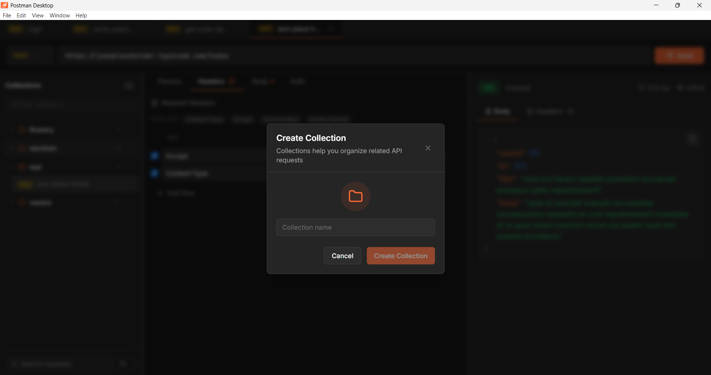
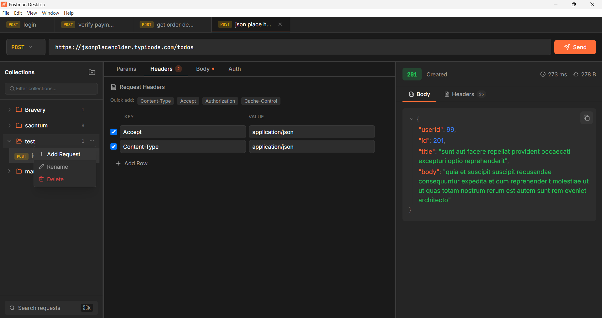
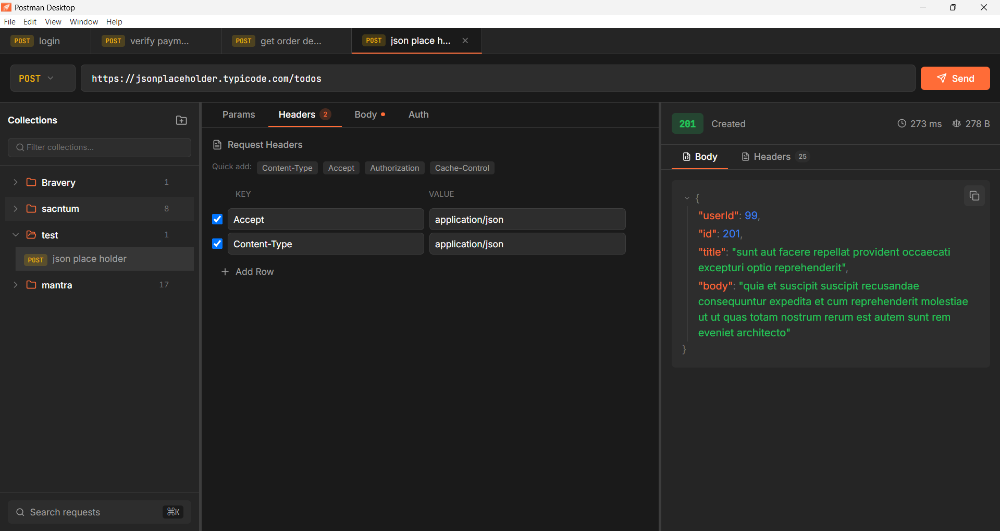
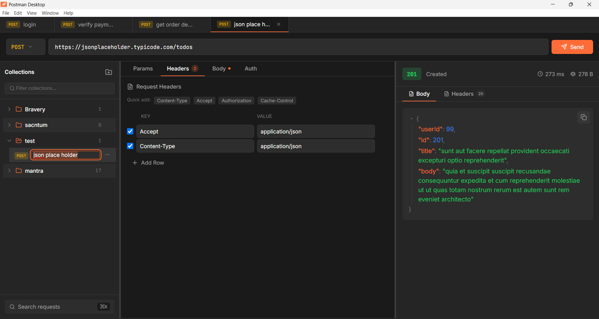
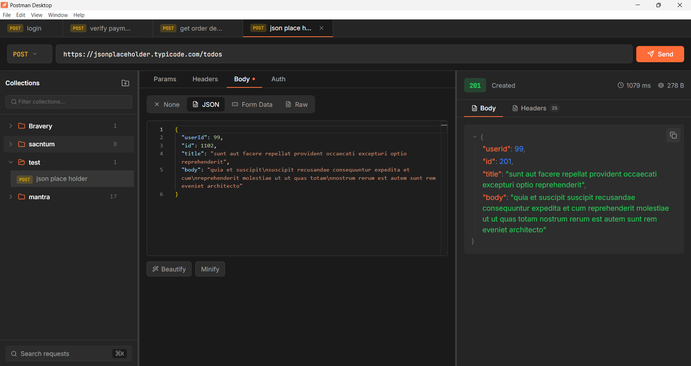
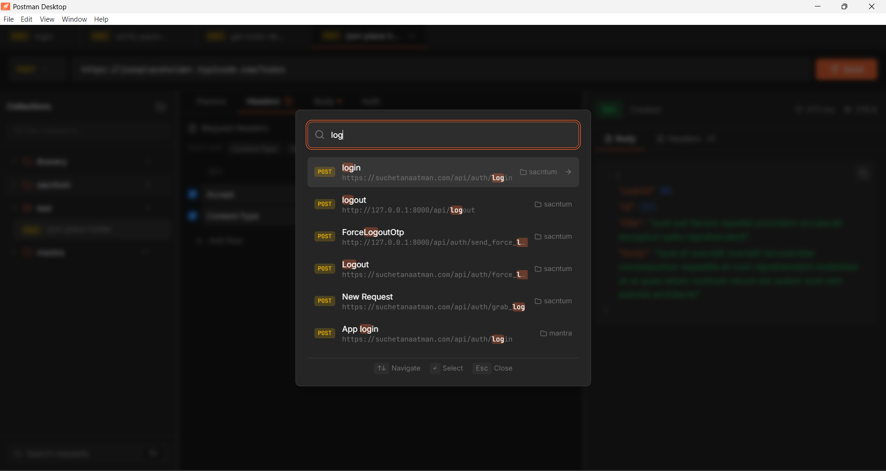

## install dependencies
```
npm i
```
## install renderer dependencies
```
cd app/renderer
npm i
```

## run the app
```
npm start
```

## build the app
```
npm run build
```

## screenshots
### Create Collection

### Add Request

### Dedicated Auth

### Multiple Headers with Custom Token

### Rename Request

### Response

### Search Collection


