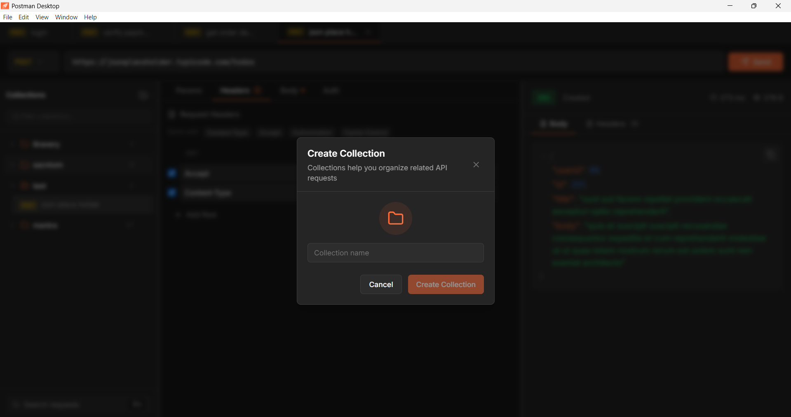
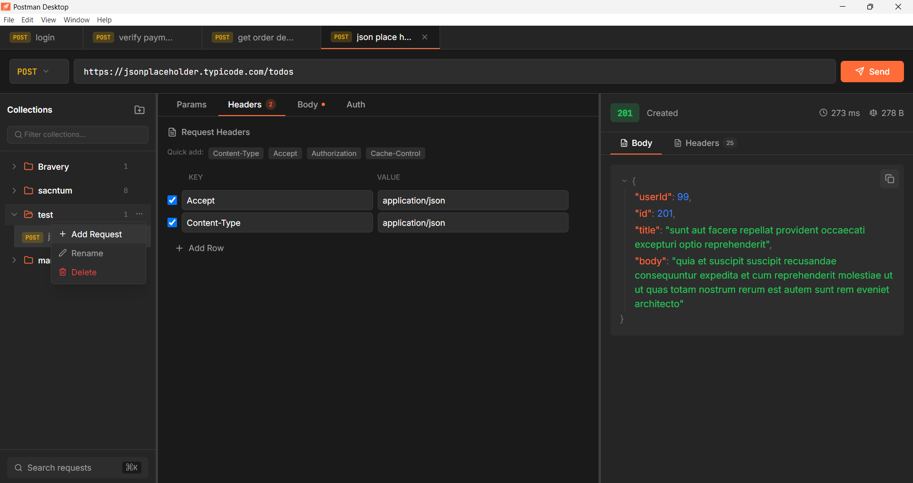
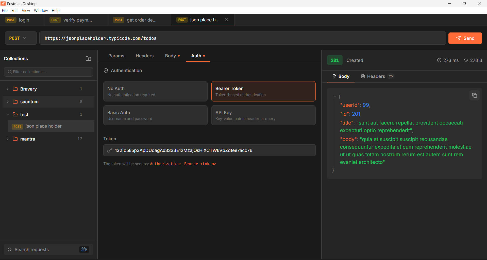
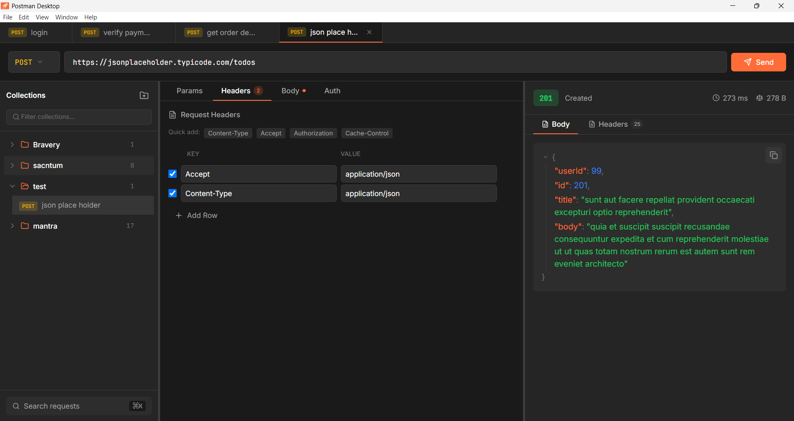
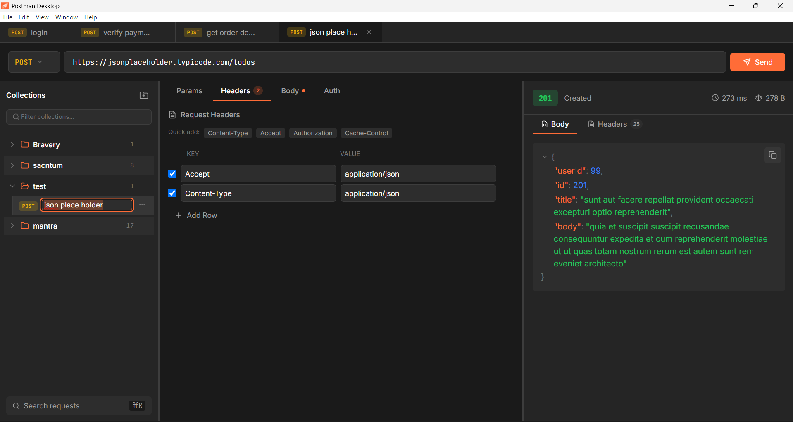
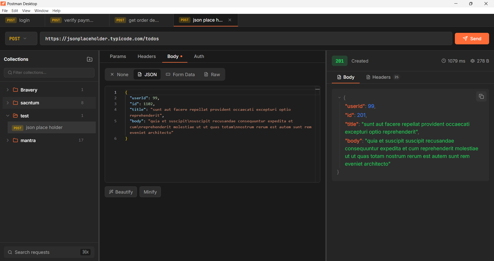
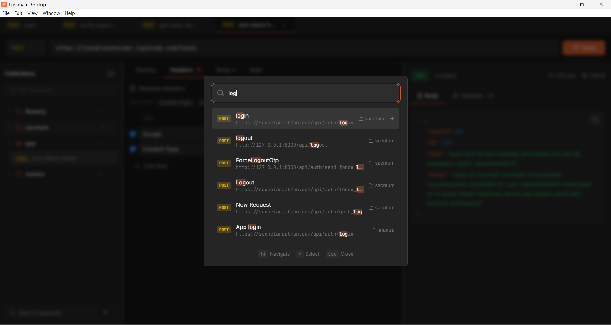

# Testly - Fast, Private & Free Postman Alternative

**Testly** is a fast, privacy-first **REST API client and Postman alternative** that runs entirely on your local machine.

No account required. No cloud sync. No telemetry. No subscription. **Free forever.**

Test APIs, organize requests into collections, manage environments, configure authentication, and inspect responses - all from a lightweight desktop application designed for a fast local workflow.

## Why Testly?

Testly is built for developers who want a simple alternative to Postman without accounts, cloud dependencies, or paid plans.

- 🚀 Fast startup
- 🔒 Privacy-first
- 💻 Runs entirely locally
- ☁️ No cloud sync
- 👤 No account required
- 📡 No telemetry
- 💰 Free forever
- 🚫 No subscriptions or paywalls
- 📴 Offline-first workflow

## Features

- REST API client
- HTTP request testing
- API testing
- Request collections
- Environment variables
- Authentication
- Custom headers
- Import and export
- Request search
- Response inspection
- Offline/local storage

## Testly vs Postman

Testly focuses on the core API development workflow while keeping your data local. It is designed as a lightweight, free, privacy-focused Postman alternative for developers who don't want accounts, cloud synchronization, telemetry, or subscriptions.

## Screenshots

### Create Collection

### Add Request

### Dedicated Auth

### Multiple Headers with Custom Token

### Rename Request

### Response

### Search Collection

